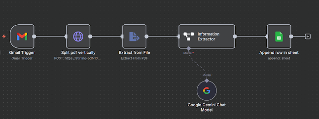
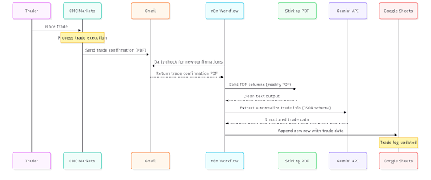
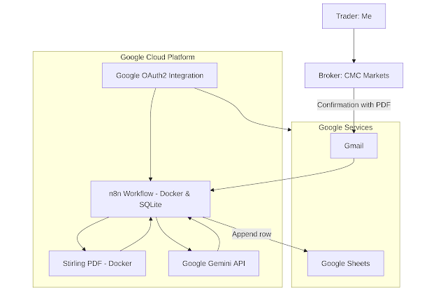

# Automating Trade Logging from CMC Markets

Like many retail brokers, **CMC Markets doesn't offer an API or robust reporting tools**. For anyone who wants clean trade history for analytics, tax, or journaling, this quickly becomes painful. My solution was to automate the process end-to-end: from receiving a trade confirmation email, to structured trade data in Google Sheets.

And yes — **PDFs are the villain of this story.**

## The Workflow

1. **Trade execution** → I place a trade on CMC Markets.
2. **Email notification** → CMC emails me a trade confirmation (with an attached PDF).
3. **Workflow trigger** → Once per day, an **n8n workflow** scans for new emails.
4. **PDF preprocessing** → Since CMC's PDFs are laid out in two columns, the text extraction would normally jumble data. I fix this by splitting the PDF into vertical halves with **Stirling PDF** before extracting text.
5. **Data extraction** → Text is parsed and mapped into a clean JSON schema (ticker, price, brokerage, dates, etc.).
6. **Storage** → A row is appended to Google Sheets with the structured trade data.

## Why Use an LLM?

CMC's PDFs aren't static:

* The **format has changed over time**
* Content shifts depending on the product and trade details

A plain regex parser would constantly break. Instead, I use an **LLM (Google Gemini API)** to harden the parsing:

* It understands variations in layout and wording
* It can normalize into a predictable schema
* It reduces maintenance overhead when CMC inevitably tweaks their template again

## The Tech Stack

* **n8n** (Dockerized, SQLite backend) → workflow orchestration
   * _If you do the same on a serverless platform, make sure to turn off CPU throttling!_
* **Stirling PDF** (Dockerized, via API) → PDF preprocessing
* **Google Gemini API** → intelligent extraction into JSON schema
* **Google Sheets** → storage and reporting
* **GCP** → hosting and OAuth2 integration with Google products

## The N8N Workflow



## Sequence Diagram



## Architecture



## Preprocessing Challenge

At first, I tried converting the PDFs to images, then back to text using OCR. The results were unreliable — OCR mangled numbers, tickers, and formatting.

The breakthrough was **splitting the PDF into vertical halves before extraction**. This preserves reading order and makes the text parseable. From there, Gemini can do its job reliably.

---

**Conclusion**

Can we all agree: Enough with the pdfs already?

## JSON Schema Provided to Gemini

```json
{
  "$schema": "http://json-schema.org/draft-07/schema#",
  "$id": "https://example.com/trade-confirmation.schema.json",
  "title": "Trade Confirmation",
  "description": "Schema for extracted trade confirmation data from buy/sell documents",
  "type": "object",
  "properties": {
    "price": {
      "type": "number",
      "description": "Price per unit/share",
      "minimum": 0,
      "exclusiveMinimum": true,
      "examples": [31.7813, 0.045, 125.50]
    },
    "count": {
      "type": "integer",
      "description": "Quantity of units/shares traded",
      "minimum": 1,
      "examples": [31, 50000, 1000]
    },
    "buyOrSell": {
      "type": "string",
      "description": "Transaction type",
      "enum": ["BUY", "SELL"],
      "examples": ["BUY", "SELL"]
    },
    "brokerage": {
      "type": "number",
      "description": "Brokerage fees charged",
      "minimum": 0,
      "examples": [0, 10, 19.95]
    },
    "tax": {
      "type": "number",
      "description": "GST/tax amount",
      "minimum": 0,
      "examples": [0, 1, 1.99]
    },
    "total": {
      "type": "number",
      "description": "Total amount - for BUY: amount payable, for SELL: net proceeds",
      "minimum": 0,
      "exclusiveMinimum": true,
      "examples": [985.22, 2239, 12550]
    },
    "ticker": {
      "type": "string",
      "description": "Security ticker/code symbol",
      "pattern": "^[A-Z]{2,5}$",
      "examples": ["QSML", "CDT", "NV1", "AAPL", "TSLA"]
    },
    "transactionDate": {
      "type": "string",
      "format": "date",
      "description": "Date when the transaction occurred",
      "pattern": "^\\d{4}-\\d{2}-\\d{2}$",
      "examples": ["2025-09-01", "2022-05-05", "2024-12-15"]
    },
    "settlementDate": {
      "type": "string",
      "format": "date",
      "description": "Date when the transaction settles",
      "pattern": "^\\d{4}-\\d{2}-\\d{2}$",
      "examples": ["2025-09-03", "2022-05-09", "2024-12-17"]
    }
  },
  "required": [
    "price",
    "count",
    "buyOrSell",
    "brokerage",
    "tax",
    "total",
    "ticker",
    "transactionDate",
    "settlementDate"
  ],
  "additionalProperties": false,
  "examples": [
    {
      "price": 31.7813,
      "count": 31,
      "buyOrSell": "BUY",
      "brokerage": 0,
      "tax": 0,
      "total": 985.22,
      "ticker": "QSML",
      "transactionDate": "2025-09-01",
      "settlementDate": "2025-09-03"
    },
    {
      "price": 0.045,
      "count": 50000,
      "buyOrSell": "SELL",
      "brokerage": 10,
      "tax": 1,
      "total": 2239,
      "ticker": "CDT",
      "transactionDate": "2022-05-05",
      "settlementDate": "2022-05-09"
    }
  ]
}
```
