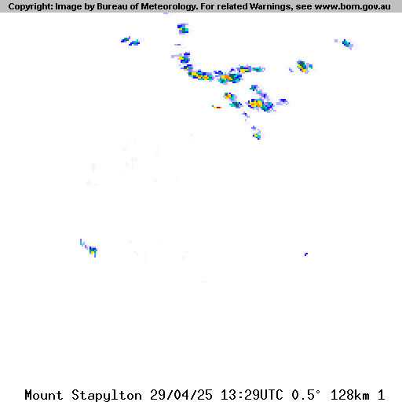

# Radar Rainfall Modelling with BOM and GCP

Recently, I was approached by a friend with a task that felt a bit unconventional, very interesting and nicely bite sized. He was working on a water modelling problem and wanted to build a system that used **spatial rainfall data** to dynamically estimate water levels and flood risk. Accuracy was the main goal, and we are both curious about how far we could push it with limited resources.

## Starting Strong (and Hitting a Wall)

Our first instinct was to go for high-resolution weather station data. After digging around, we found what we needed on **Wundermap**, and with a bit of work, we started scanning through station metadata across the Brisbane region. The idea was to downsample from the hundreds of available stations, aggregate the data, and plug it into the model.

But it didn't take long for reality to kick in. Between API rate limits, unpredictable access restrictions, and computational cost, it quickly became obvious that this wasn't going to scale without a price tag we weren't ready to pay. Hence, we pivoted.

## A Different Angle: Radar as a Spatial Source

Rather than trying to ingest huge amounts of direct station-based data, we started thinking differently. Radar images from the **Bureau of Meteorology (BOM)** gave us exactly what we needed—spatial rainfall patterns—just encoded visually.

We switched gears. Instead of thousands of API calls constantly, we'd scrape just **three small images** every five minutes—one for each radar coverage zone (64km, 128km, 256km) around Brisbane. The images could be processed to extract rainfall intensity by interpreting their **pixel colours**.

It's lightweight, elegant, and completely sidestepped the data licensing and scraping limitations we'd faced earlier.

## From Script to Service

Once we had a working script, the next challenge was keeping it alive.

Running it locally wasn't going to cut it—we needed a setup that would just tick away in the background, continuously downloading, processing, and storing data. So I started looking at cloud options.

I decided to use **Google Cloud Platform (GCP)**, partly because it's developer-friendly and partly because I didn't want this mixing into any of my existing infrastructure. I spun up a fresh project.

The script wasn't compute-heavy and only needed to run every five minutes, so I went for a **serverless approach**—specifically **Cloud Run**. It meant we wouldn't pay for idle time, and the tooling around deployment, especially for CI/CD pipelines, was genuinely excellent. I containerised the function, set up a pipeline with **GitHub Actions**, and routed the output into a GCS bucket.

## Scheduling Woes

At first, I planned to use **GCP's Cloud Scheduler** for the periodic calls, but the pricing was frankly extortionate for such a simple task. (>$40 per month)

So I turned to GitHub Actions. I figured the included runner minutes would be enough, given the script only took ~3 seconds. But two issues popped up: (1) Action runners take time to spin up—far more than the function execution time—and (2) GitHub's cron scheduling isn't precise enough for a 5-minute interval. It was inconsistent and felt more like a workaround than a solution.

Eventually, I landed on **cron-job.org**, a surprisingly solid and free alternative that's handled the scheduling reliably since.

## Architecture Evolves

Originally, this was just a single Cloud Run function. But I found myself wanting a little more flexibility—mainly around custom container images (for things like `cv2`) and future auth handling—so I rebuilt it as a **Cloud Run app** running Flask.

The app now exposes a single HTTP endpoint. I briefly toyed with adding authentication, but ultimately decided against it. The endpoint doesn't return anything sensitive, and it already checks for duplicates before fetching upstream data, so the risk was minimal. Simplicity won.

I'd initially used `cv2` for image processing, but GCP's base serverless image doesn't play nicely with its dependencies. So I rewrote that part with **Pillow**, which worked out great and reduced container size too.

## Under the Hood: What the App Actually Does

The app focuses on three radar IDs:

* `bris_256` → IDR662
* `bris_128` → IDR663
* `bris_64` → IDR664

Every five minutes, it:

1. Fetches the latest radar images from BOM using proper headers and timestamp logic.
2. Processes the images to convert **pixel colours into rainfall rates**, using a 16-level colour mapping from BOM (0 mm/h to 360 mm/h).
3. Cleans the images by trimming 16-pixel top/bottom borders, downsamples them (2x2 pixels per cell), and converts the result into a tidy **pandas DataFrame**.
4. Stores both the raw image and the processed CSV into a **GCS bucket**.
5. Skips downloads if data already exists and handles any partial failures gracefully.

## Frontend: Minimal, But Clear

I added a simple HTML frontend using a Flask template. It's not fancy, but it does the job well:

* **Green** messages for successful downloads
* **Orange** for skipped (already processed)
* **Red** for any errors

It works well on mobile and gives a quick view of what's happening under the hood.

## Technical Stack Recap

* **Python**: `datetime`, `requests`, `pandas`, `Pillow`, `Flask`, `numpy`
* **Cloud**: GCP (Cloud Run, GCS), cron-job.org
* **DevOps**: GitHub Actions CI/CD, Docker

**Data Flow:**

BOM Radar Images → Download → Process → Downsample + Rainfall Mapping → CSV → Cloud Storage

It's built to fail gracefully, skip duplicates, and run autonomously with no human intervention.

## Looking Back and Ahead

What started as a rough script to scrape weather data turned into a lightweight cloud-native radar data pipeline—efficient, scalable, and kind of elegant.

There are still directions we could go: better rainfall interpolation, trying with paid, more granular data sources, layering in topography, for now, we're running to collect data for my flood engineer friend to use in development of the water model. But for now, this little collection and preprocessing system ticks away quietly in the cloud.
