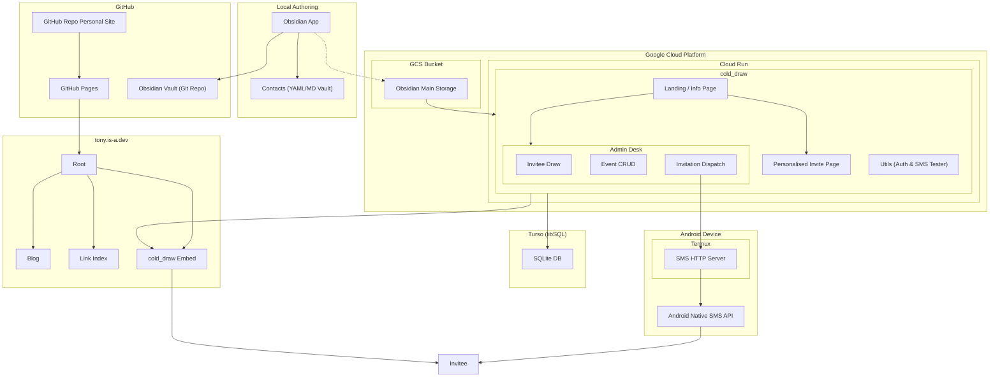

import graphImage from './graph.png';
import adminDeskImage from './admin desk.png';
import adminSendPanelImage from './admin send panel.png';
import invitePageImage from './invite page.png';
import inviteResponseFormImage from './invite response form.png';

<Image src={graphImage} alt="Obsidian Graph" className="max-w-full max-h-[100vh] h-auto rounded-lg shadow-sm " />

# Cold Draw

I've coded up and deployed a messy little personal project - it's a bit weird, but I also think it's quite fun as a social and technical exercise.

In short: _I built a tool to Draw names randomly from a lifetime of contacts. Invite them to dinner. Repeat._

>[Dinner Party](https://tony.is-a.dev/dp/)

## the idea

### Motivation

I want to organise dinner parties with all the good people in my life.
Specifically, I want to organise **_a lot_** of **very casual** dinner parties with a **very diverse mix** of the good people in my life.
I also like learning and building tools; so, as much for the functionality and for the fun of it, I've built a lightweight toolset I've called `cold_draw`.
Also, I want to start working more in the open and welcome some scrutiny.
It's also worth mentioning that, as a consequence of putting a wine subscription referral code on a high traffic coupon aggregator site back at uni, I have amassed an unreasonably large collection of wine for very cheap. I would really love to share it around.

### Mechanism

The way I'm operating this project is through a social application that (unlike the social apps we're familiar with, hopefully) actually leads to positive social interaction.
The application supports event planning by surfacing a mix of old contacts as invite suggestions that I then screen.
My hope is that this random mixing of contacts helps to

- break down some of the normally convenient social silos that form over time.
- Resurface old/cold relationships (hence the name cold_draw)

Additionally, by welcoming plus 1s I hope these dinners serve as a catalyst to meet new people.
Provided these assumptions hold, I'd love to make this routine and systematic. For now, the application I've built is bit of nerdy fun for the basement dweller in me. But I do hope it helps to embed this as a positive routine practice.

### Friction
- I fully expect that this whole exercise will feel a bit awkward - particularly at the start.
	1. Getting older is nice because I find myself caring less about being awkward.
	2. I think some criticisms (particularly around AI use, overcomplication, and being a little impersonal) are definitely founded, I'm working on tweaking the project; and am open to suggestions.
- I can't believe how polar the valence of responses has been. One of:
	- An enthusiastic "Wow, this is a fantastic idea!!!" (~50%)
	- Is this spam? (~10%)
	- Radio silence (~40%)
		- I assume this is (~50% "this is spam"; and 50% genuine disinterest)
- I don't want the dinner parties to even feel like dinner parties; in an ideal world, I'd like this to just feel like an average Tuesday dinner, but with friends.

### dinner party retro

- We had the first dinner party on 2026-02-28. There were times it was a little awkward I think largely due to some non-overlapping social circles and unfamiliarity.
- I improvised a big chicken bacon zucchini and tomato pasta bake.
- Of the people invited, not many came, but more than enough did to fill the room with lots of friends.
- I need to emphasise to bring take away containers more. No one did.
- Wowee; dinner was delicious; thankyou to
	- [Emma Ferguson]([Instagram](https://www.instagram.com/em.a.ferguson/)) for the watermelon salad & cinnamon tea cake
	- [Hamish McDougal](https://www.instagram.com/mcdougallhamish/) for a succulent chinese meal
	- [Bronte Ingram](https://www.instagram.com/bronte06/) & [Keon Modini](https://www.instagram.com/keon.modini/) for the Ricotta Dip and bocconcini salad. 
- Keon and Bronte brought along a card game [No Thanks!](https://en.wikipedia.org/wiki/No_Thanks!_\(game\)) and it's a pretty fantastic casual little game.
- Friends of friends are already asking to come along; so provided this stays administratively manageable; I'm starting to feel that the concept has some positive early signals.

### Project Next Steps

- Continue hosting dinner parties.
- Refine voice of invitations to be less spammy.
- Share this blog post.
- Embed this in my routine
- Open source the application and maybe set up a hosted version for others to use.

## the technical

### PRM (Personal Relationship Modelling)

For the 2 people that have been following along with my blog posts, I've been a bit interested with personal knowledge management systems; and generally using semi-structured text files as a database. With AI trends over the last few years, I don't think I have to explain why I think that sounds like a suddenly useful way of capturing information. With that said, I've been a little obsessed with setting up and optimising my Personal Knowledge Management (PKM) system, calendar, diary, journal, address book. Since [my last pkm post](https://tony.is-a.dev/blog/logseq-pkm/) I have decided to centralise and own all of my contacts and address book.

1. Export: 
	- I've exported all facebook friends
	- I've exported all linkedin connections
	- I've exported all of my mobile/google contacts.
2. Schema:
	- All Contacts have been transformed into a standardised yaml+markdown file that describes name, birthday, a uuid, contact details, job title, gender, social links/ids.... through a quick python script that collated up from the different sources.
3. Reimport
	- The cold_draw application shouldn't read 1000s of files from a mounted (or even local) file system. We cache important info from the contacts into the cold_draw sqlite db.

At this point I started hitting performance bottlenecks in logseq so I moved everything over to obsidian - which ergonomically is much the same, if not better.
Any way, all that is to say I now have a powerful, flexible and integrated address book.

### cold_draw application:

#### Admin Stories implemented

- View an event calendar
- Event desk page with all management and quicklinks available.

<Image src={adminDeskImage} alt="Admin desk: event calendar and management quicklinks" className="max-w-full max-h-[100vh] h-auto rounded-lg shadow-sm " />

- Create events
- Toggle between published and draft events
- Be prompted with a random name from the user pool; with random weights tailored by a function.
- Ability to search for a specific name.
- For each person in an event; see their invite/rsvp status.
- For each person in the event; have readily available information such as links to social profiles.
- Another menu that allows the admin to draft messages from a template. (Filling in name; unique invite link; event date, time, location...)

<Image src={adminSendPanelImage} alt="Admin send panel: draft message from template with invite link and event details" className="max-w-full max-h-[100vh] h-auto rounded-lg shadow-sm " />

- Ability to send messages through all channels available - either directly sending a text through the termux server; or by copying the message and opening up a social media messaging thread in a new tab.

#### Invitee Experience

- Invite page provided with a personalised url.

<Image src={invitePageImage} alt="Personalised invite page with unique URL" className="max-w-full max-h-[100vh] h-auto rounded-lg shadow-sm " />

- Invitee should receive a personalised text.
- Invitee should be able to RSVP at link.

<Image src={inviteResponseFormImage} alt="Invitee RSVP and response form" className="max-w-full max-h-[100vh] h-auto rounded-lg shadow-sm " />

- Invitee should be able to select an alternate event.

#### General Requirements

- A little bit of security would be nice, but this isn't really a valuable, or high risk target - I'm more interested in friction minimisation (please don't hack my setup).
- Minimal cost
- Invitee experience should be simple, but not impersonal.
- Invites should be smooth to deliver.
- Screening individuals should be streamlined.
- Screening should be mostly random, but: try to balance the gender and try to provide a distribution of attendees with a mixed current distance.
- Minimal auth overhead.
- Must be smooth to deploy and update

### SMS Server

Ideally I'd like to move away from platforms engineered to consume all of my bandwidth. Which means I'd like to distance myself from facebook, linkedin, instagram etc... and own my own relationship graphs, address books etc.. So, SMS is preferred.
With that in mind; I wanted to integrate the outbound messages from the application with outbound sms. This isn't totally impersonal, I want messages to come from me; and also I don't want to pay for a 3rd party service. So, no to twilio.
On android you can download a command line interface tool called termux. And then an extension "termux:API" provides an api to access the phone's SMS functionality.
The android text editor isn't a fantastic ide; neither is the termux shell; or any other mobile IDEs I played with. So I set up a setup script in github, and `curl`'ed it in from the githubusercontent url for the script in here:
Repo: [littletuna4/termux-scripts](https://github.com/littletuna4/termux-scripts)
This downloads deps if they're not already installed, and writes the server file into a convenient location. The server itself is available to devices on the local network and listens for http requests  with a phone number and message; these fields are then decoded and sent.
This server is run from a script ~/rts.sh which exposes a http endpoint that can be called from the cold_draw client in the browser on my laptop.
By default devices on the network have ephemeral IP addresses; which would mean that I have to manually update the android SMS server IP every few days/weeks; however, our modem can be configured to offer static IP leases to specific devices; which I have configured to reduce system operation overhead.

## Tools List

- ORM: Drizzle
- Database: formerly markdown files on gcp bucket; now sqlite
- Database host: turso (dirt cheap)
- Front end: a couple of next.js apps.
- Dynamic cold_draw application: GCP cloud run
- Static wrapper site: Github pages
- DNS: [is-a.dev](github.com/is-a-dev/register)
- CICD: Github actions/google cloud build/docker
- SMS integration: Android/Termux

## Learnings and callouts:

- Markdown files do not a good database for a multi-user system. The second you have more than one user or process running, re-writing a file becomes a potentially destructive action. Entries in a db should be atomic, so writes don't risk overwriting unrelated changes.
- Damn, AI is getting scary good. And I'm so frequently impressed by how easy GCP is in comparison to other clouds.
- FDroid is a third party app store for android that pulls down some of the guard rails and handcuffs.

### Technical Next steps

- Review and refine the actual random selection algorithm - this has been fully vibe coded - I have no idea if it actually meets the requirements I've laid out. Sure seems random for now though.
- Setup notifications, and confirmation/check in/follow-up flows
- Setup db backups; with migration away from obsidian as the authoritative event database, we lose versioning.
- Devise a plan for incremental contact updates as new people come into my life.

## Deployment architecture:

